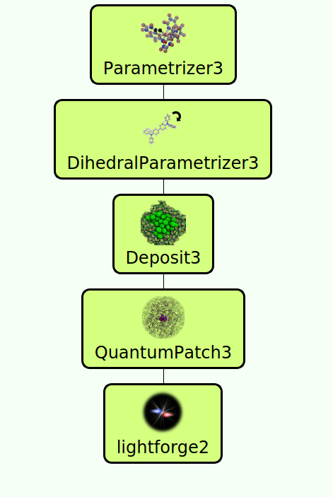
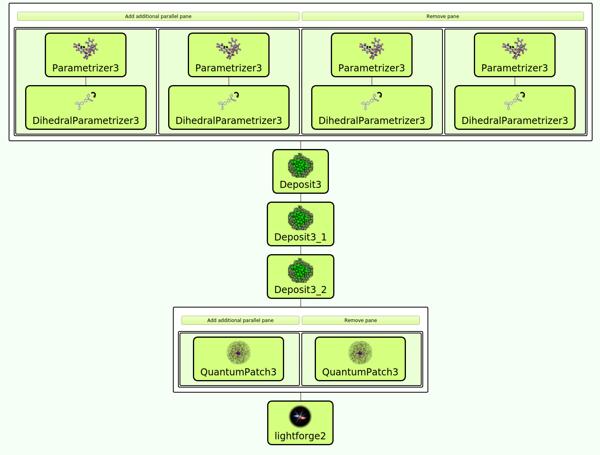

# OLED Workflow
## Introduction
To simulate properties of OLED devices we apply a multiscale workflow to translate molecular properties to the device level and analyze the impact of micoscopic properties on device performance. The resulting time-dependent and spatially resolved trajectories of charge carrier and exciton dynamics can be used to systematically identify, analyze and eliminate performance bottlenecks in OLED devices. 

Fig1. Simplified multiscale OLED workflow for a single material device.

## Workflow details
In principle this workflow consists of four basic steps, illustrated in Fig. 1: In the first step, customized force-fields are derived for all molecules involved. Subsequently, we run a simulation protocol mimicking physical vapor deposition to generate digital twins of thin films with atomistic resolution. In a third step we perform a full quantum chemical electronic structure analysis of molecules in the thin film morphology to compute molecular properties required for the simulation of charge carrier and exciton dynamics,  taking into account environmental effects. Ultimately, we conduct kinetic Monte-Carlo (KMC) simulations in LightForge, resulting in all-particle trajectories for further analysis of the system dynamics. 

The workflow depicted in Fig. 1 and also provided as template in this repository examplifies the setup of a multiscale simulation with SimStack for a single material device, i.e. a layer of a single organic electronic molecule embedded between two electrode. To simulate charge carrier and exciton dynamics in realistic more complex OLEDs, this workflow can easily be extended via Drag&Drop with SimStack. Fig. 2 depicts an example for a three-layer OLED consisting of a hole-transport layer, an emission-layer comprising a host material and an emitter, and an electron-transport layer. The settings of the workflow depend heavily on details of the OLED, e. g. the type of molecules involved, layer setups and type of measurement (photoluminescence measurements, I-V, IQE, etc.). Please refer to the [Nanomatch documentation page](http://docs.nanomatch.de), especially tutorials on OLED simulations [here](http://docs.nanomatch.de/usecases/ANPDIrpiqStack/ANPDIrpiqStack.html) and [here](http://docs.nanomatch.de/nanomatch-modules/LightForge/LightForgeOutputs.html#excitonic-events) for details. 

Fig. 2: Workflow to simulate charge carrier and exciton dynamics in a three-layer OLED.

